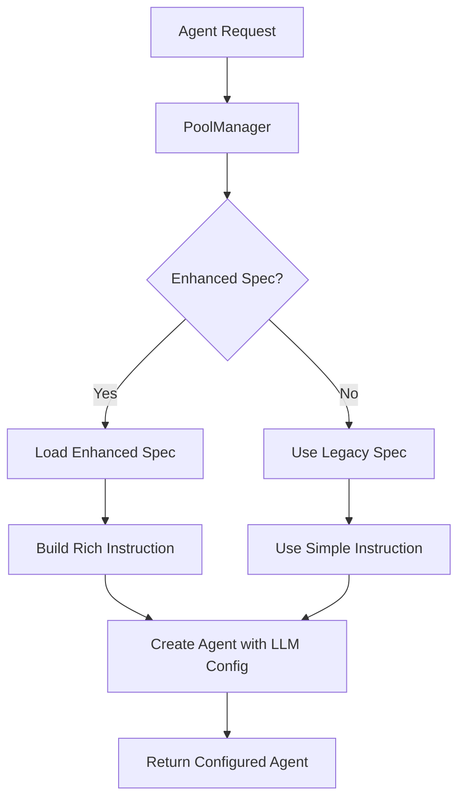

# Enhanced Agent Specifications

## Overview

The Slack Meta Agent now supports CrewAI-style enhanced agent specifications that provide rich personas, configurable behaviors, and dynamic management capabilities.

## Key Features

1. **Rich Agent Personas**: Each agent has a backstory, role, and goal
2. **Configurable LLM Settings**: Per-agent model, temperature, and token limits
3. **Dynamic Configuration**: Store and update specs in database
4. **Backward Compatibility**: Legacy specs still work
5. **Performance Optimized**: Caching and pool management

## Architecture



## Enhanced Spec Structure

```python
@dataclass
class EnhancedAgentSpec:
    # Core Identity
    id: str                     # Unique identifier
    name: str                   # Human-friendly name
    role: str                   # One-line role summary
    backstory: str              # Rich persona context
    goal: str                   # Primary objective

    # Behavior Configuration
    allow_delegation: bool      # Can spawn sub-agents
    verbose: bool              # Debug logging
    cache: bool                # Response caching

    # LLM Configuration
    llm_provider: str          # "openai", "anthropic", etc.
    llm_model: str             # "gpt-4o", "gpt-4o-mini", etc.
    temperature: float         # 0.0-1.0 sampling
    max_tokens: int            # Token limit

    # Execution Settings
    max_iterations: int        # Max think→act loops
    tools: List[str]          # Available tool IDs
    memory_policy: Dict       # Memory config
    timeout_ms: int           # Execution timeout

    # Advanced Prompting
    system_prompt: str        # Core instructions
    few_shot_examples: List   # Example interactions
    constraints: List[str]    # Behavioral rules
    output_format: str        # Expected format
```

## Database Schema

```sql
CREATE TABLE agent_specs (
    id TEXT PRIMARY KEY,
    name TEXT NOT NULL,
    role TEXT NOT NULL,
    backstory TEXT,
    goal TEXT,
    allow_delegation BOOLEAN DEFAULT false,
    verbose BOOLEAN DEFAULT true,
    cache BOOLEAN DEFAULT true,
    llm_provider TEXT DEFAULT 'openai',
    llm_model TEXT DEFAULT 'gpt-4o-mini',
    temperature FLOAT DEFAULT 0.3,
    max_tokens INTEGER DEFAULT 2000,
    max_iterations INTEGER DEFAULT 10,
    tools TEXT[],
    memory_policy JSONB DEFAULT '{}',
    timeout_ms INTEGER DEFAULT 30000,
    system_prompt TEXT,
    few_shot_examples JSONB DEFAULT '[]',
    constraints TEXT[],
    output_format TEXT DEFAULT 'markdown',
    capabilities TEXT[],
    is_dynamic BOOLEAN DEFAULT false,
    version TEXT DEFAULT '1.0.0',
    created_at TIMESTAMP WITH TIME ZONE DEFAULT NOW(),
    updated_at TIMESTAMP WITH TIME ZONE DEFAULT NOW()
);
```

## Using Enhanced Specs

### 1. Run Database Migration

```bash
# Apply the migration to create tables and default specs
psql $DATABASE_URL < slack_meta_agent/migrations/002_agent_specs.sql
```

### 2. Manage Specs via CLI

```bash
# List all agent specs
python slack_meta_agent/scripts/manage_agent_specs.py list

# Show detailed spec
python slack_meta_agent/scripts/manage_agent_specs.py show data_researcher

# Update a spec
python slack_meta_agent/scripts/manage_agent_specs.py update data_researcher \
  --temperature 0.1 \
  --model gpt-4o

# Export spec to file
python slack_meta_agent/scripts/manage_agent_specs.py export data_researcher spec.json

# Import spec from file
python slack_meta_agent/scripts/manage_agent_specs.py import-spec new_spec.json
```

### 3. Create Custom Specs

```python
from slack_meta_agent.models import EnhancedAgentSpec

# Create a new specialized agent
custom_spec = EnhancedAgentSpec(
    id="market_analyst",
    name="Senior Market Analyst",
    role="Analyze market trends and provide investment insights",
    backstory="You are a Wall Street veteran with 20 years of experience...",
    goal="Provide accurate market analysis with actionable insights",
    llm_model="gpt-4o",
    temperature=0.2,
    tools=["brave_search", "fetch", "supabase"],
    constraints=[
        "Always cite sources for market data",
        "Provide confidence levels for predictions",
        "Include risk disclaimers"
    ],
    system_prompt="You are an expert market analyst. Focus on data-driven insights..."
)

# Save to database
await registry.save_agent_spec(custom_spec)
```

## Example Enhanced Specs

### Intent Analyzer

```json
{
  "id": "intent_analyzer",
  "name": "Intent Classification Specialist",
  "role": "Analyze user messages and classify intent with high accuracy",
  "backstory": "You are a linguistic expert trained in understanding user intent...",
  "goal": "Accurately classify user intent to enable optimal agent selection",
  "llm_model": "gpt-4o-mini",
  "temperature": 0.1,
  "tools": ["pattern_matcher", "context_analyzer"],
  "constraints": [
    "Prefer SINGLE_AGENT for simple requests",
    "Only suggest ORCHESTRATED for complex multi-step tasks",
    "Always provide confidence assessment"
  ]
}
```

### Data Researcher

```json
{
  "id": "data_researcher",
  "name": "Senior Research Analyst",
  "role": "Gather real-time data and conduct thorough research",
  "backstory": "You are a meticulous researcher with investigative journalism background...",
  "goal": "Provide accurate, real-time information with proper sources",
  "llm_model": "gpt-4o",
  "temperature": 0.2,
  "tools": ["brave_search", "fetch", "supabase"],
  "constraints": [
    "Always use tools for current data",
    "Provide specific numbers and details",
    "Include data freshness timestamps"
  ]
}
```

## Benefits

1. **Better Agent Performance**: Rich personas lead to more contextual responses
2. **A/B Testing**: Easy to test different configurations
3. **Dynamic Updates**: Change agent behavior without code changes
4. **Cost Optimization**: Use cheaper models for simple tasks
5. **Observability**: Track which configurations work best

## Migration Path

1. **Phase 1**: Database schema and CLI tools (current)
2. **Phase 2**: UI for agent spec management
3. **Phase 3**: Automated A/B testing framework
4. **Phase 4**: ML-based spec optimization

## Best Practices

1. **Start Simple**: Begin with core agents, expand gradually
2. **Version Control**: Export specs to Git for tracking
3. **Test Changes**: Use staging environment first
4. **Monitor Performance**: Track metrics per spec version
5. **Document Changes**: Keep changelog for spec updates

## Troubleshooting

### Specs Not Loading

- Check database connection
- Verify migration was applied
- Check logs for errors

### Performance Issues

- Enable caching for frequently used agents
- Optimize temperature settings
- Review token limits

### Legacy Compatibility

- Legacy specs auto-convert to enhanced format
- No code changes required for existing agents
- Gradual migration supported
